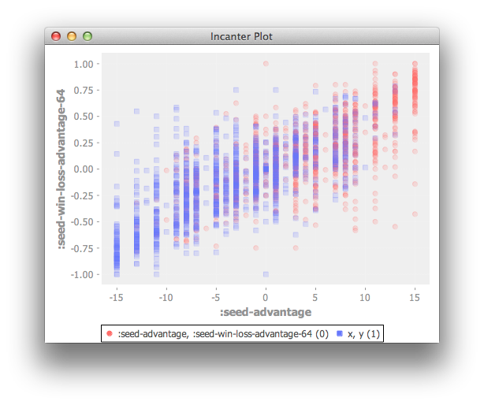

Moneyball? More like Funnyball amirite?
=======================================

Funnyball is a a binary classifier for predicting post-season college basketball victories based on regular season data and seeds.

Potential Data sets
---------

1. [Kaggle data](https://www.kaggle.com/c/march-machine-learning-mania/data)
2. NCAA
   1. [Rosters](http://www.ncaa.com/schools/albany-ny/basketball-men)
   2. [Teams](http://stats.ncaa.org/team/inst_team_list?sport_code=MBB&division=1)
   3. [Rosters](http://stats.ncaa.org/team/roster/11540?org_id=26172)

###Other potential data sets to incorporate

Team Stats
    - transform %

Vegas Odds

Regular season versus
    Unfortunately I found that regular season matchups of teams in the post season are too sparse to use, and not predictive.

Regular season win records vs common teams
    - i.e. top 4/8/16 seeds that season
    - i.e. all other seeded teams in the tournament

Aggregated Team Ratings
    - Sagarin

News
    - Injuries
    - Coaching Changes

Player based
    - biometric
    - Individual statistics

Approaches
----------

1. Predict winner of team A vs B - Gaussian
2. Predict scores for A and B - Binomial or Poisson)
3. Predict proportion of posessions

Construct a summary file for all previously known postseason victories or losses
-----------------------------------

For all matchups in previously known postseasons

- Observation (team1_team2)
- DID_WIN_IN_POSTSEASON (0,1)
- SEED_DIFFERENTIAL (lseed - wseed; higher means winner was favored)
- REGULAR_SEASON_WIN_LOSS (when the teams matched up in the regular season, what was the ratio of team 1 to team 2's wins)

This can be done with

1. ``(use 'funnyball.build :reload-all)``
2. ``(save-to-r-file)``

Run a binary classifier on that dataset to build a model for predicting victory
---------------------------------------

Visualize the data in a scatter plot

1. ``(use 'funnyball.model :reload-all)``
2. ``view-dataset``

You should see a graph like this:

Run a random forest classifier on this data to see how significant the features are in predicting the response variable:

- Run the steps in ``R_model.R`` in RStudio. Note that you may need to install the following packages
  + e1071
  + ggplot2
  + randomForest

Profit!
-------

Run the models against the current year's regular season results and tournament seeds

1. ``(use 'funnyball.predict :reload-all)``
2. ???
